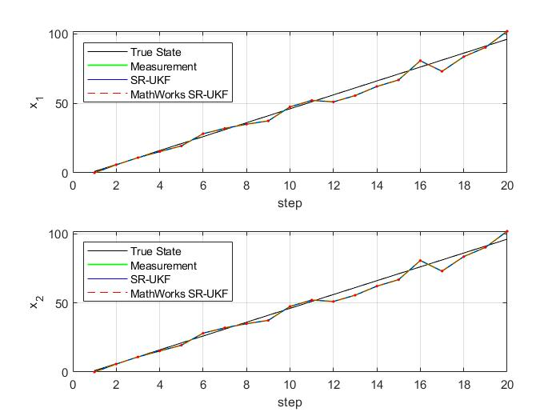

# MATLAB Kalman Filters



This repository contains Kalman Filter implementations in MATLAB that can be used
for embedded code-generation.

Currently, only the Square-Root Kalman Filter with the Scaled-Unscented Transform
is provided, as is defined by Rudolph Van der Merwe.[^merwe]
It replicates in large parts the [Square-Root UKF by MathWorks](https://de.mathworks.com/help/control/ref/unscentedkalmanfilter.unscentedkalmanfilter.html?s_tid=doc_ta)
but has slightly different property names, function syntax and calculation schemes.
The results when using either implementation are very similar in tested scenarios.

The SR-UKF implementation has successfully been used to test and design an UKF-algorithm
in MATLAB. The filter was then ported to Simulink using a MATLAB-function block
to generate code for an embedded system (dSPACE Microautobox III).

[^merwe]: Merwe R, Wan E (2003) Sigma-Point Kalman Filters for Probabilistic Inference in Dynamic State-Space Models. Proceedings of the Workshop on Advances in Machine Learning

## Requirements

Only a base MATLAB installation is required, no toolboxes!

## Compatibility

Compatability has only been tested for MATLAB 2021a.

## Usage

You can either use the library for recursive offline estimation or code generation for
embedded systems. For a guide on generating code (or using the MATLAB classes in
Simulink), [see this official guide by MathWorks](https://de.mathworks.com/help/control/ug/generate-code-for-online-state-estimation-in-matlab.html).

## Examples

You can either use the library for recursive offline estimation or code generation for
embedded systems.

### Square-Root UKF MATLAB example

You can instantiate the SR-UKF very simply. In this example, a fictional state
transition (f) and measurement function (h) are used. Covariance matrices are omitted
and are set to default values.

```matlab
f = @(x,v,u) x*(1+v) + u;
h = @(x,n) x;
x0 = 1;
ukf = spkf.SquareRootUnscentedKalmanFilter(f,h,x0,[],[],[]);
```

To perform a predict step, do:

```matlab
u = 10;  % arbitrary control input
ukf.predict(u)
```

The prediction is corrected in a similar fashion:

```matlab
y = 11;  % arbitrary measurement
ukf.correct(y)
```

The results can be viewed by accessing the class properties:

```matlab
ukf.State
ukf.StateCovariance
```

Or by using the optional outputs of the predict and correct functions:

```matlab
[x, P] = ukf.predict(u);
[x, P] = ukf.correct(y);
```
